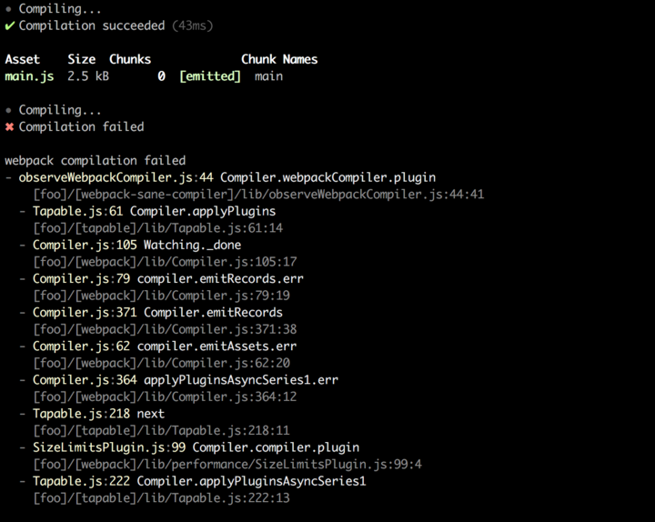
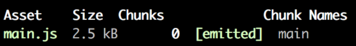

# webpack-sane-compiler-reporter

[![NPM version][npm-image]][npm-url] [![Downloads][downloads-image]][npm-url] [![Build Status][travis-image]][travis-url] [![Coverage Status][codecov-image]][codecov-url] [![Dependency status][david-dm-image]][david-dm-url] [![Dev Dependency status][david-dm-dev-image]][david-dm-dev-url] [![Greenkeeper badge][greenkeeper-image]][greenkeeper-url]

[npm-url]:https://npmjs.org/package/webpack-sane-compiler-reporter
[npm-image]:http://img.shields.io/npm/v/webpack-sane-compiler-reporter.svg
[downloads-image]:http://img.shields.io/npm/dm/webpack-sane-compiler-reporter.svg
[travis-url]:https://travis-ci.org/moxystudio/webpack-sane-compiler-reporter
[travis-image]:http://img.shields.io/travis/moxystudio/webpack-sane-compiler-reporter/master.svg
[codecov-url]:https://codecov.io/gh/moxystudio/webpack-sane-compiler-reporter
[codecov-image]:https://img.shields.io/codecov/c/github/moxystudio/webpack-sane-compiler-reporter/master.svg
[david-dm-url]:https://david-dm.org/moxystudio/webpack-sane-compiler-reporter
[david-dm-image]:https://img.shields.io/david/moxystudio/webpack-sane-compiler-reporter.svg
[david-dm-dev-url]:https://david-dm.org/moxystudio/webpack-sane-compiler-reporter?type=dev
[david-dm-dev-image]:https://img.shields.io/david/dev/moxystudio/webpack-sane-compiler-reporter.svg
[greenkeeper-image]:https://badges.greenkeeper.io/moxystudio/webpack-sane-compiler-reporter.svg
[greenkeeper-url]:https://greenkeeper.io

Beautiful reporting for [webpack-sane-compiler](https://github.com/moxystudio/webpack-sane-compiler) compilation events.



## Installation

`$ npm install webpack-sane-compiler-reporter --save-dev`


## Usage

```js
const startReporting = require('webpack-sane-compiler-reporter');

const { stop, options } = startReporting(compiler, {/* options */});

// Now, just call compiler.run() or compiler.watch() to start a compilation and start outputting reports
// Calling stop() will stop listening to the compiler events
// Furthermore, you have access to the options that were computed by the merge of provided options and the defaults
```

### Available options:

| Name   | Description   | Type     | Default |
| ------ | ------------- | -------- | ------- |
| stats | Display webpack stats after each compilation | boolean/string (`true`, `false` or `'once'`) | `true` |
| write | Callback responsible for printing/outputting the generated report messages | function | Prints to `stderr` |
| [printStart](https://github.com/moxystudio/webpack-sane-compiler-reporter/commit/a2e035470c0418d8d375e777c8e153cbedf7034c#diff-168726dbe96b3ce427e7fedce31bb0bcR16) | Callback that generates a report message for when a compilation starts | function |  |
| [printSuccess](https://github.com/moxystudio/webpack-sane-compiler-reporter/commit/a2e035470c0418d8d375e777c8e153cbedf7034c#diff-168726dbe96b3ce427e7fedce31bb0bcR17) | Callback that generates a report message for when a compilation succeeds | function |  |
| [printStats](https://github.com/moxystudio/webpack-sane-compiler-reporter/commit/a2e035470c0418d8d375e777c8e153cbedf7034c#diff-168726dbe96b3ce427e7fedce31bb0bcR20) | Error that generates a string representation of a WebpackStats instance | function |  |
| [printFailure](https://github.com/moxystudio/webpack-sane-compiler-reporter/commit/a2e035470c0418d8d375e777c8e153cbedf7034c#diff-168726dbe96b3ce427e7fedce31bb0bcR18) | Callback that generates a report message for when a compilation fails | function |  |
| [printError](https://github.com/moxystudio/webpack-sane-compiler-reporter/commit/a2e035470c0418d8d375e777c8e153cbedf7034c#diff-168726dbe96b3ce427e7fedce31bb0bcR19) | Callback that generates a string representation of an error | function |  |


### API

As shown in the [usage](#usage) section abose, the result of adding reporting on a compiler is a function that, when invoked, stops listening to the compiler events, hence halting any further output.

### Other exports

For convenience (or fun) this package also exports the default render methods:

```js
const reporter = require('webpack-sane-compiler-reporter');

reporter(compiler, {
    printSuccess: () => reporter.renderers.renderError(new Error('Nope!')), // ¯\_(ツ)_/¯
});

```


## Tests

`$ npm test`   
`$ npm test -- --watch` during development


## License

[MIT License](http://opensource.org/licenses/MIT)
